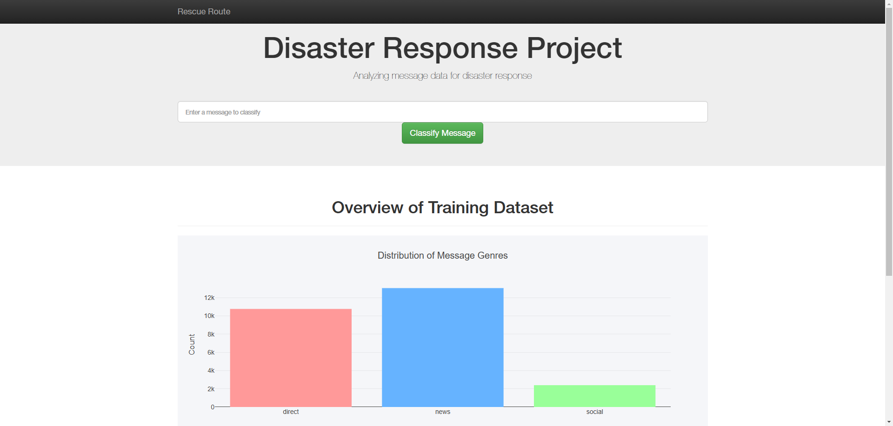

<h1 align="center">
    <a>
    
    </a>
</h1>
<p align="center">
  <i align="center">A disaster message respond Flask web-app using ML model</i> 🚀</i>
</p>

<h4 align="center">
  <a href="https://opensource.org/licenses/Apache-2.0">
    
  </a>
  <a href="https://discord.gg/ujuACE7t">
    
  </a>
  <a href="https://x.com/thekarmeo">
    
  </a>
  <a href="https://www.youtube.com/channel/UCY4vwkWDlehuG3d0jTskKTA">
    
  </a>
</h4>

# RescueRoute

:star: **Star us on GitHub — it motivates us a lot!**

[RescueRoute]() is a lab in learning program course ADY201c in FSoft. The dataset contains pre-labelled tweets and messages from real-life disaster events. The project's aim is to build a Natural Language Processing (NLP) model to classify messages related to disaster events.

## Usage

To use RescueRoute, follow these steps:

1. **Clone the repository**:
    ```sh
    git clone git@github.com:Chunporo/ADY201c.git
    cd lab4
    ```

2. **Install the required dependencies**:
    ```sh
    pip install -r requirements.txt
    ```

3. **Run the project**:
    ```sh
    python app\run.py
    ```
4. Go to `http://127.0.0.1:3001`

## Structure
    .
    ├── app                             # Flask app build 
        ├── static
        ├── templates
        ├── run.py
    ├── data                            # ETL data from csv to database     
    │   ├── disaster_categories.csv          
    │   ├── disaster_messsages.csv         
    │   ├── disaster_response.db             
    │   ├── etl_pipeline.py                                  
    ├── img                             # Media file     
    ├── model                           # Train and save model
    └── README.md

## Contributing

We welcome contributions to RescueRoute! Please see our [CONTRIBUTING.md](CONTRIBUTING.md) for details on how to get started.

## Screenshot



## Acknowledgements


Feel free to reach out if you have any questions or need further assistance. Thank you for your interest in RescueRoute!
