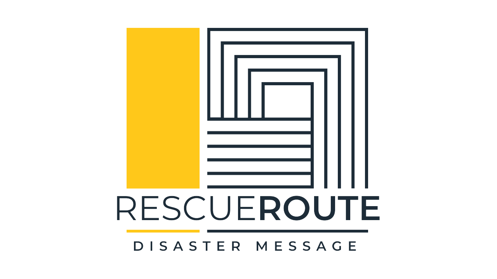

# RescueRoute

:star: **Star us on GitHub — it motivates us a lot!**

[RescueRoute]() is part of the Data Science Nanodegree Program by Udacity in collaboration with Figure Eight. The dataset contains pre-labelled tweets and messages from real-life disaster events. The project's aim is to build a Natural Language Processing (NLP) model to classify messages related to disaster events.

## Usage

To use RescueRoute, follow these steps:

1. **Clone the repository**:
    ```sh
    git clone git@github.com:Chunporo/ADY201c.git
    cd lab4
    ```

2. **Install the required dependencies**:
    ```sh
    pip install -r requirements.txt
    ```

3. **Run the project**:
    ```sh
    python app\run.py
    ```
4. Go to `http://0.0.0.0:3001/`

## Contributing

We welcome contributions to RescueRoute! Please see our [CONTRIBUTING.md](CONTRIBUTING.md) for details on how to get started.

<a name="license"></a>
## License
[](https://opensource.org/licenses/MIT)


## Acknowledgements

- [Udacity](https://www.udacity.com/)
- [Figure Eight](https://www.figure-eight.com/)

Feel free to reach out if you have any questions or need further assistance. Thank you for your interest in RescueRoute!
